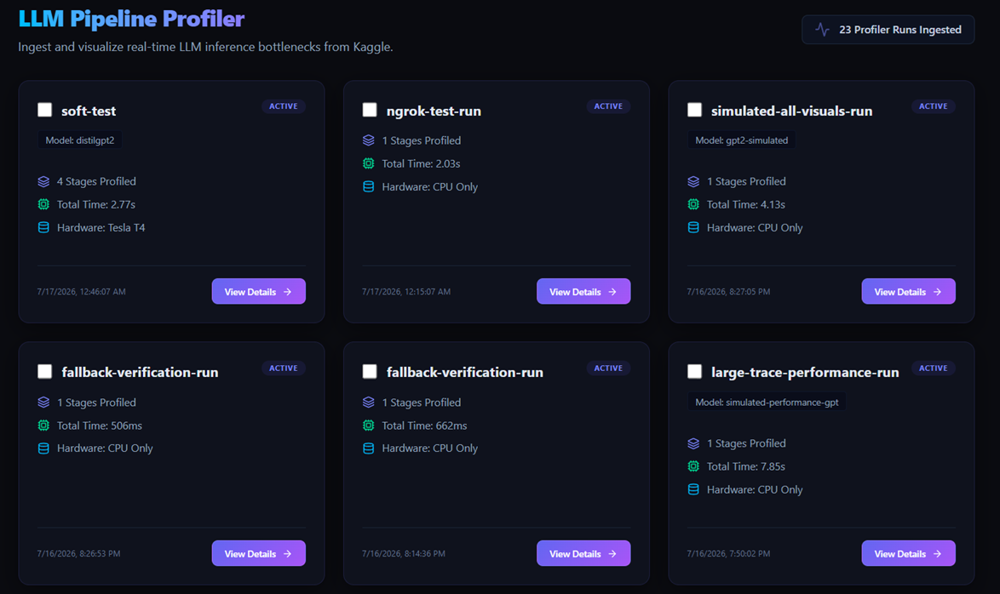
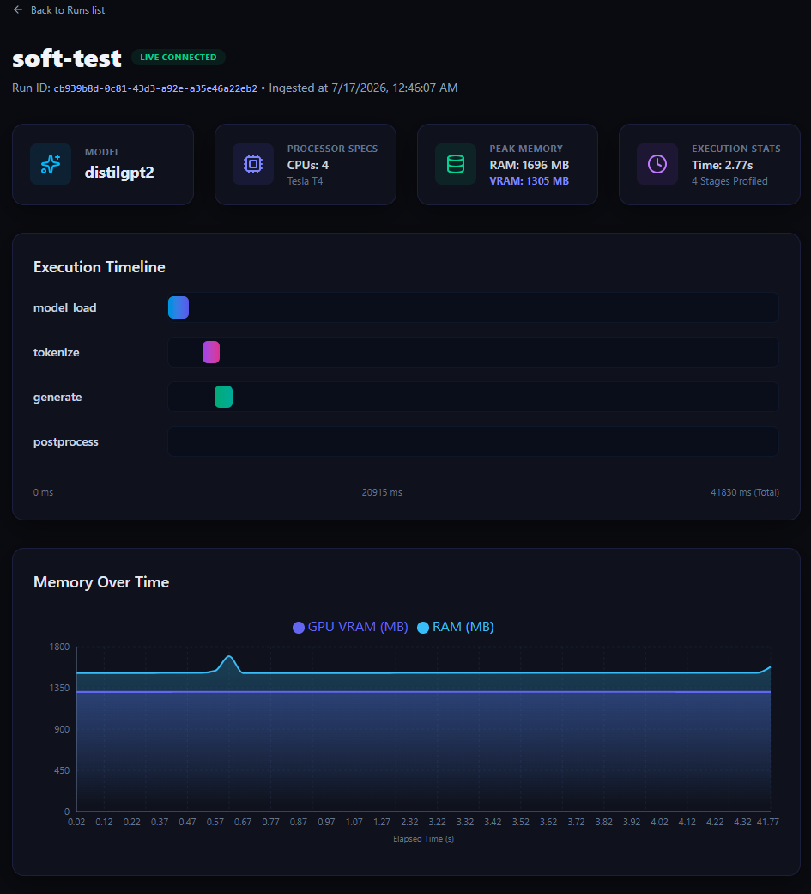
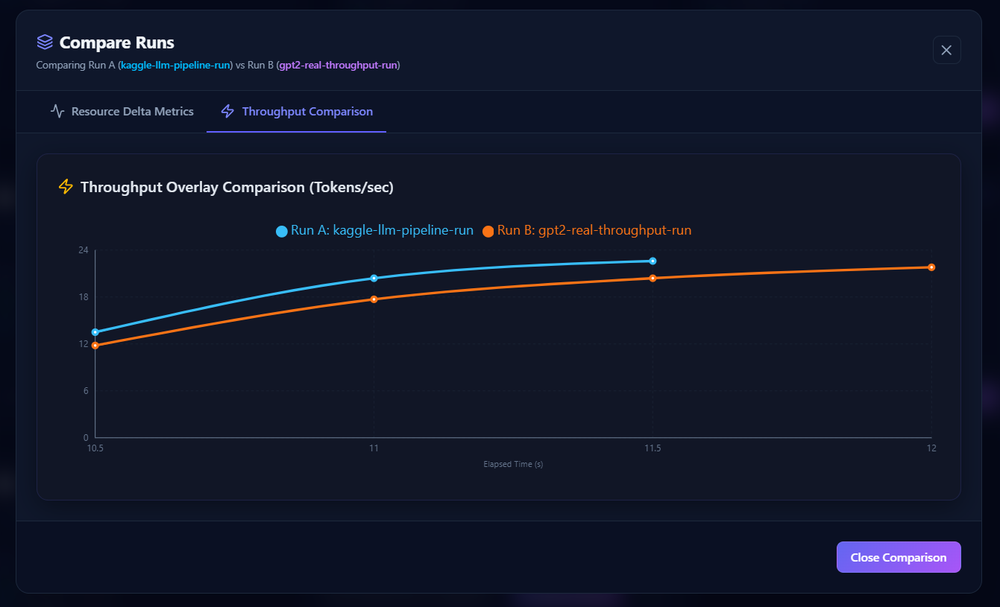
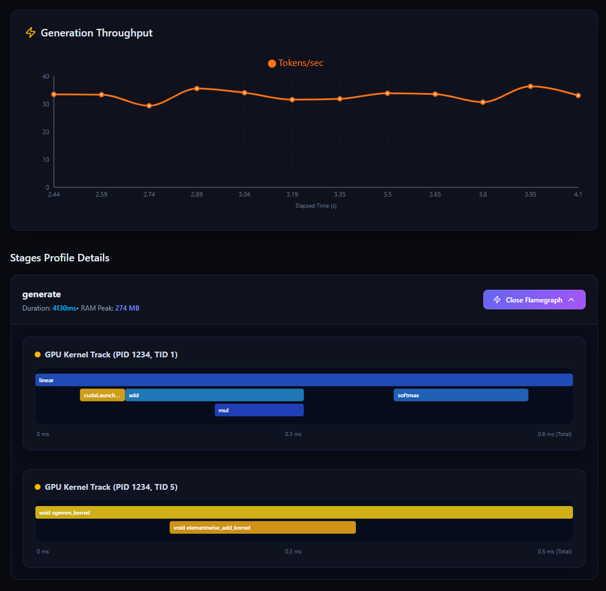

# LLM Pipeline Profiler

A full-stack profiling system for instrumenting, analyzing, and visualizing bottlenecks in LLM inference and training pipelines — model loading, tokenization, autoregressive generation, and post-processing — executed in remote environments like Kaggle notebooks, or locally.

Built to answer a practical problem: **where exactly is time and memory going in an LLM pipeline, and how do two runs compare after a change?**

---

## Why this exists

Debugging LLM pipeline performance usually means scattering `print(time.time())` calls through a notebook and eyeballing the output. This project instead wraps each pipeline stage in a lightweight tracer, captures CPU/GPU/memory metrics (down to individual GPU kernel calls via PyTorch's native profiler), and streams the result into a dashboard built for exactly this kind of analysis — timelines, memory curves, throughput, and side-by-side run comparisons.

It was designed around a real constraint: **no local GPU.** All GPU-side profiling happens on Kaggle's free GPU tier, with results POSTed to a dashboard running locally (or deployed) — no manual copy-pasting of logs required.

---

## System Architecture

| Component                              | Role                                                                                                                                                                                                                                                         |
| -------------------------------------- | ------------------------------------------------------------------------------------------------------------------------------------------------------------------------------------------------------------------------------------------------------------ |
| **`profiler-lib`** (Python)            | Context managers / decorators imported into a Kaggle or local Python session. Records stage duration, CPU%, RAM, GPU utilization/VRAM, and full PyTorch CUDA operator traces.                                                                                |
| **`sampler-cpp`** (C++)                | Optional high-frequency system sampler (NVML + `/proc`), feeding metrics to the Python tracer over a Unix Domain Socket to minimize the overhead a pure-Python sampling loop would introduce. Falls back gracefully to a pure-Python sampler if unavailable. |
| **`dashboard`** (Next.js + PostgreSQL) | Visualizes pipeline timelines, memory/throughput charts, and op-level GPU flamegraphs. Supports live-updating runs and run-to-run comparison.                                                                                                                |

Data flows in one direction only: instrumented code → local export or HTTP POST → dashboard API → PostgreSQL → UI. This was a deliberate design choice, since Kaggle kernels don't expose inbound ports — nothing can connect _into_ a running Kaggle session, so all traffic flows outward.

---

## Screenshots

**Run list overview** — all profiled runs, with multi-select for comparison.


**Stage timeline and memory usage** for a single run.


**Throughput comparison** between two runs, overlaid.


**Throughput chart and op-level flamegraph** from a real PyTorch CUDA trace.


---

## Getting Started

Recommended local development setup: PostgreSQL runs in Docker, the Next.js dashboard runs directly on the host for hot-reloading.

### 1. Start the database

```bash
docker compose up db
```

Credentials and port configuration are defined in [`docker-compose.yml`](docker-compose.yml).

### 2. Start the dashboard

```bash
cd dashboard
npm install
npx prisma db push      # sync schema to Postgres
npm run dev
```

Dashboard runs at `http://localhost:3000`.

### 3. Expose the dashboard for Kaggle (live mode)

Kaggle notebooks need a public HTTPS endpoint to POST results to. Tunnel your local dashboard with ngrok:

```bash
ngrok http 3000
```

Use the printed `https://....ngrok-free.dev` URL as the `dashboard_url` when initializing `Tracer` inside your Kaggle notebook.

### 4. Install the profiling library

```bash
pip install -e ./profiler-lib
```

This also triggers `pybind11` to compile the C++ sampler into a Python extension, if a compatible toolchain is available.

---

## Usage

```python
from llm_profiler import Tracer

tracer = Tracer(run_name="llama3-8b-inference", dashboard_url="https://your-ngrok-url.ngrok-free.dev")

with tracer.stage("model_load"):
    model = load_model(...)

with tracer.stage("generate"):
    output = model.generate(...)

tracer.export()
```

See [`examples/kaggle_notebook_example.ipynb`](examples/kaggle_notebook_example.ipynb) for a complete, runnable walkthrough.

---

## Database Inspection

Prisma Studio provides a GUI for browsing stored runs directly:

```bash
cd dashboard
npx prisma studio
```

Open `http://localhost:5555` to browse the `Run`, `Stage`, and `Metric` tables — filter, inspect, or delete records.

Other useful commands:

- `npx prisma db push` — sync `prisma/schema.prisma` changes to Postgres
- `npx prisma db seed` — run the seed script, if configured

---

## Standalone C++ Sampler

The C++ sampler can be built independently of Python packaging, for isolated testing or debugging with native tools:

```bash
cd sampler-cpp
cmake -B build
cmake --build build --config Release
```

Produces `llm_profiler_sampler` (or `llm_profiler_sampler.exe` on Windows) in `build/Release/`.

---

## Verification

```bash
python test_cpp_sampler.py           # C++ sampler bindings + graceful fallback
python test_combined_simulation.py   # simulated pipeline run, uploaded to localhost
```

---

## Components

- **Shared data schema** — a single contract (Pydantic, TypeScript, Prisma) that keeps the profiler, API, and database in sync.
- **`profiler-lib`** — tracer, CPU/GPU/memory collectors, PyTorch operator-level tracing, and export/streaming to the dashboard.
- **Dashboard** — run timeline, memory and throughput charts, op-level flamegraph, and side-by-side run comparison.
- **`sampler-cpp`** — high-frequency C++ system sampler, usable both as a Python extension and as a standalone binary.

---

## Tech Stack

- **Backend / Profiling:** Python, PyTorch (`torch.profiler`), `psutil`, `pynvml`
- **Systems:** C++, CMake, pybind11, Unix domain sockets
- **Frontend:** Next.js, TypeScript, Recharts, Prisma
- **Data:** PostgreSQL, Docker

---

## License

MIT
